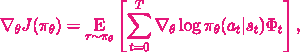

<iframe width="600" height="315" src="https://www.youtube.com/embed/0fAOLhMN1n8" frameborder="0" allow="autoplay; encrypted-media" allowfullscreen></iframe>

###### *An agent trained with supervised learinng on the Lunar lander environment.* 

Reinforcement Learning is a general, robust and performant paradigm. Its strengths become evident when combined with deep learning. Deep reinforcement learning can solve increasingly complex tasks with huge state space and complex rules. It has produced world champion-beating artificial agents in the games of chess, DOTA, go, and Starcraft. One may argue that any problem where scores are received for performing actions should be framed as a reinforcement learning problem. But behind these notable successes, lies huge problems. Deep reinforcement learning is hard to work with. A lot of effort goes into making agents learn correctly and robustly. Deep reinforcement learning also needs a huge amount of compute. Hundreds of thousands of dollars in compute is needed to reproduce the most impressive results. A lone researcher with limited resources cannot comfortably go beyond Atari games state space when experimenting with game playing agents. 

Lots of effort has been made to improve the sample efficiency of these deep RL algorithms. Model based reinforcement learning is a promising research direction. The environment dynamics can be mastered using supervised/ self-supervised learning, then smaller representations can be used to learn to maximise cumulative reward. This paradigm is attractive because once you learn representations of the state, you may use any kind of valid algorithm to maximise rewards.

Another promising paradigm is Upside down RL, where the appropriate action to take in a given state is learned by injecting additional information when learning to map state to actions. In settings where this has worked,  an expected goal, in addition to the state, is used as input. The agent is trained to produce actions that reach the goal. The goal in this case is to gain a given reward in a given number of time steps. Inspiration from this paradigm leads me to this month's article.

We know that we can use a neural network to map state to actions and use a reward proxy in our loss function to maximise the probability that the actions taken will yield the highest reward. 
An example of this loss function is the policy gradient loss:

<figure>

<figcaption>Fig 1. Policy gradient loss.</figcaption>
</figure>

As shown above to get the gradient we not only need the episode trajectories in the actions a(t), predicted by phi given a state s(t),  we also need to have Ø(t) which is a form of the reward function.
Adding this  Ø(t) to our loss function can make the agent harder to train and introduces a host of new hyperparameters to tune. 
Although there have been a number of improvements to replace the Ø(t) function. A valid research question to ask is if we can remove the reward from our loss function and still have an agent perform actions that maximise reward.

Imitation learning, where a set of human/expert demonstrations are used to train a policy has been successful in training robust game plating agents. But this method needs human/ expert demonstrations in the first place. This is an inefficient and low yield way of collecting data for training a policy. 

A better approach given the constraints, is to find a way that we can collect high quality data for supervised learning without using any kind of demonstrations.  We define high quality data as state action pairs that can be used to improve a suboptimal policy.
In this first article in the series, we explore the use of the reward function to select high quality state action pairs for the model to train on. In this way we get rid of Ø(t) and also show that we can get promising results on toy tasks, while using a much simpler loss function.

#### HIGH QUALITY EPISODE SELECTION USING A REWARD HEURISTIC

The simplest choice of a heuristic for obtaining high quality data is using the top K rewards . This data that can be collected by performing probabilistic actions with our current policy and sorting the episodes by rewards from highest to lowest. We can then randomly pick state action pairs from the top K episodes and use them to train a neural network.

To explain this method step by step:
1. Initialise a neural network **f(x)** that takes states as input and outputs actions
2. Collect data by using **f(x)** to collect state-action pairs for N number of episodes.
3. Sort the episode data by reward from highest to lowest.
4. Select top K episodes and sample state action action pairs from these
5. Train **f(x)** with these state action pairs
6. Repeat from 2 till reward is satisfactory.

#### Results

We use the above method to maximise rewards on two open ai gym tasks: CartPole and Lunar Lander.
CartPole Results
The model can consistently get to the top score of 200 in the environment

Batch size = 256; max timesteps = 70; updates per iter: 100; episodes sampled per iter: 150

Lunar Lander Results
However, the same fixed hyperparameters do not work in the LunarLander environment. 

Run1; random seed; Batch size = 256; Total Rew Possible: >200

Increasing sample size aka batch size achieves significantly higher scores but is still unstable.
Run1 seed = 46; batch size = 2048;

The fact that we can get good results by choosing top K training episodes and iteratively training on its state action pairs, merits further investigation. There may exist other methods of getting high quality data and this is the main focus of this continuing research. 

The next article in this series will highlight efforts in making the algorithm more stable, data selection, adding more complex test games and conducting experiments on why this works. Some of the planned experiments have already been completed and provide interesting insights.

***At Synthetic Mind, we are pioneering a new way of doing AI research which we call Audience supported research. In addition to free bi monthly articles like this one, we would like to provide more value to our most interested readers. If you would like to support this research, suggest its direction,  get more in depth insights, explore further experiments, or would like to get technical support for repurposing the work produced here for your own research problems you can [Subscribe](https://www.patreon.com/syntheticmind)  to our weekly newsletter for a $10 monthly fee.***

#### References

- [Upside Down RL](https://arxiv.org/abs/1912.02877)